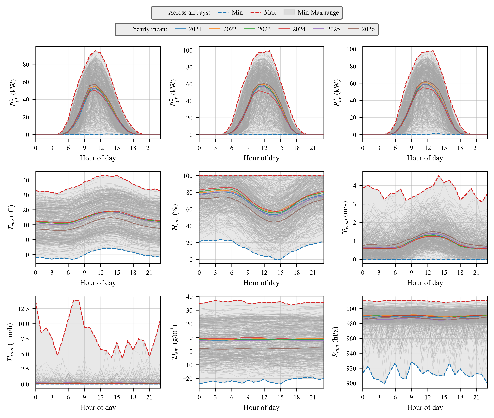
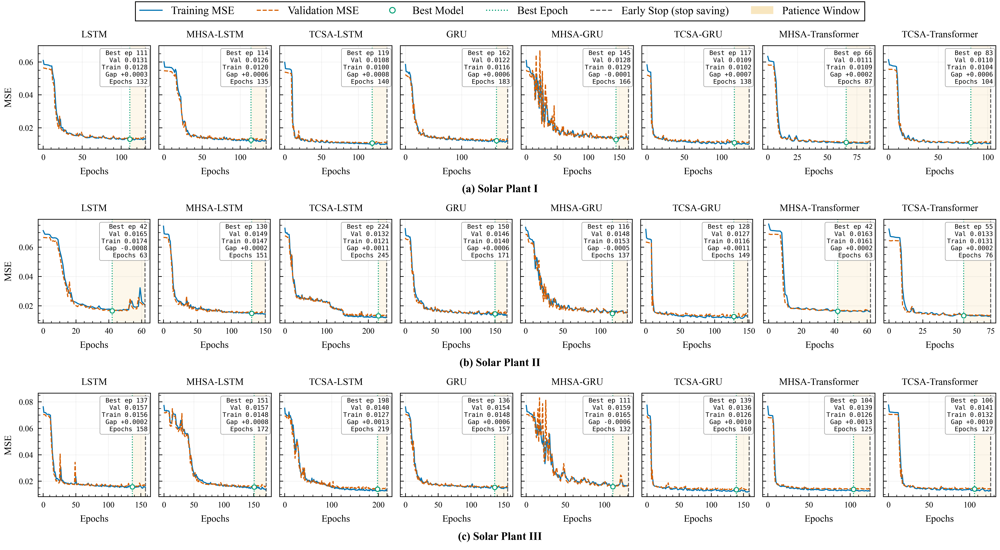
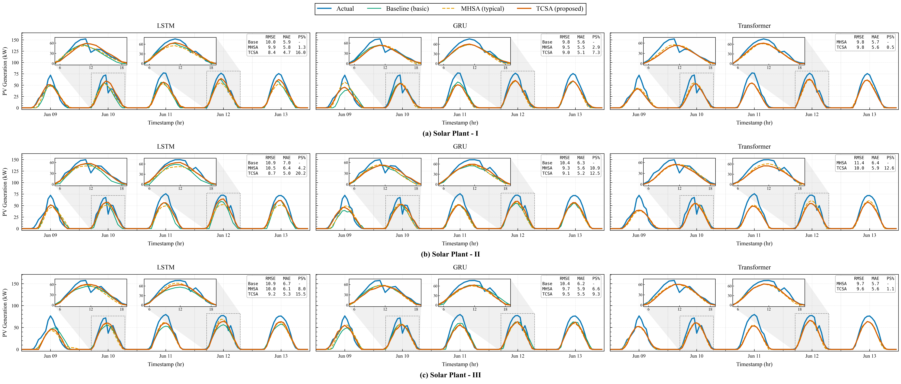
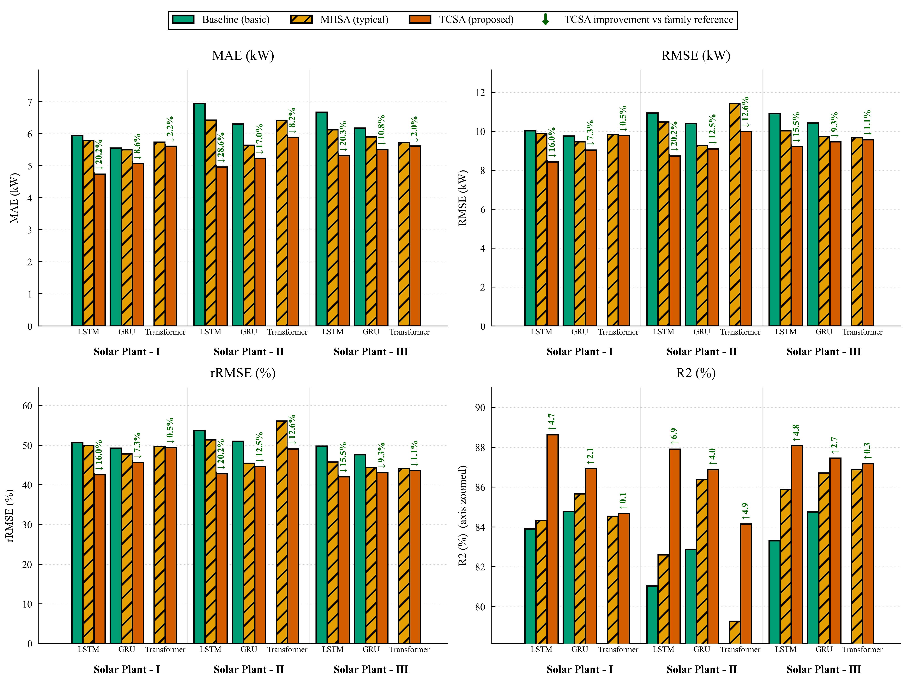

# Improving Day-Ahead Photovoltaic Power Forecasting with TCSA

**PV power-generation forecasting for solar plants.** This repository is the
research pipeline and interactive simulator behind a study that proposes
**Temporal Context Self-Attention (TCSA)** — an attention mechanism tailored
to the diurnal, seasonal structure of solar generation — and benchmarks it
against baseline and multi-head self-attention (MHSA) LSTM/GRU/Transformer
models for day-ahead PV forecasting.

### 🔗 Live demo

**[xundullah.github.io/Demo--TCSA-SolarGen-Prediction](https://xundullah.github.io/Demo--TCSA-SolarGen-Prediction/)**

The demo hosts **SPFS (Solar-Plant Forecasting Simulator)** — the same
`index.html` in this repo — a browser dashboard that replays each plant's
predicted vs. actual 24 h generation over time. No install required.

## Overview

Eight deep-learning forecasting models — **LSTM**, **GRU**, and
**Transformer**, each in a **baseline**, **MHSA**, and **TCSA (proposed)**
variant (Transformer has no plain baseline; MHSA is its reference) — are
trained on 168 h (7-day) input windows to predict the next 24 h of PV
generation, for three solar plants at the **Site** located in **Gyeongju-si,
Gyeongsangbuk-do, South Korea**.

| Family      | Baseline | MHSA (typical) | TCSA (proposed) |
|-------------|----------|-----------------|------------------|
| LSTM        | ✓        | ✓               | ✓                |
| GRU         | ✓        | ✓               | ✓                |
| Transformer | —        | ✓ (reference)   | ✓                |

## Results

Figures below are generated by `Code/Site02_DataPreparation.ipynb` and
`Code/Site02_ResultAnalysis.ipynb` via `Library/dataAnalysis.py` and
`Library/modelEvaluation.py`, exported as vector PDF + 600 dpi PNG under
`Export/Figure/Site-02/` using a colorblind-safe (Okabe-Ito) IEEE style.

### 1. Diurnal generation & weather patterns



Hour-of-day profiles for PV output and weather variables across the full
Site-02 record (2021–2026). Each panel overlays the grey per-day traces, the
all-days Min/Max envelope and mean, and one coloured line per calendar year
so seasonal drift and year-to-year variability are visible before any
modelling happens. Produced by `dataAnalysis.plot_diurnal_patterns`, called
from `Code/Site02_DataPreparation.ipynb`.

### 2. Learning curves — all models, all plants



A 3 (plant) × 8 (model) grid of training/validation MSE curves. Each panel
marks the best epoch (arg min validation loss), the early-stop epoch, and
the patience window between them, plus an info box with the train/val MSE
at the best epoch and the generalization gap — a direct check that no model
overfits and that early stopping triggered as intended. Produced by
`modelEvaluation.plot_learning_curves_grid`.

### 3. Prediction vs. actual comparison



24 h forecasts vs. ground truth for every model and plant, with two
magnified daylight insets per panel and a per-panel RMSE/MAE/skill-score
table. All scalar metrics are computed over the **full test set** (not just
the displayed days) and exported to
`Export/Data/Site-02/PredictionComparison-PkW-AllPlants-Metrics.csv`.
Produced by `modelEvaluation.plot_prediction_comparison`.

### 4. Metric summary — TCSA improvement



Grouped bars for MAE, RMSE, rRMSE, and R², one panel per metric, three
plants per panel, and a Base/MHSA/TCSA cluster per plant. The TCSA bar in
each cluster is annotated with its improvement over the family reference
(baseline, or MHSA for the Transformer family) — % reduction for error
metrics, percentage-point gain for R². Also exports
`MetricSummary-PkW-AllPlants-TCSA-Improvement.csv`. Produced by
`modelEvaluation.plot_metric_summary`.

Hight light this https://xundullah.github.io/Demo--TCSA-SolarGen-Prediction/ this is for demo and simulation 

## Repository layout

```
Code/                               Main research pipeline notebooks (Site-02 study)
  Site02_DataPreparation.ipynb        Load the pre-processed dataset, clean/fill gaps,
                                       plot diurnal patterns, scale and window the data
  Site02_ModelDevelopment.ipynb       Train all 8 models x 3 plants (TensorFlow/Keras)
  Site02_ResultAnalysis.ipynb         Evaluate models and generate the figures above

Library/                            Reusable Python modules shared by the notebooks
  dataProcessing.py                   PV/weather NaN-filling (climatology + diurnal
                                       bootstrap), raw plotting helpers
  dataAnalysis.py                     Diurnal-pattern figures, spike removal
  modelDevelopment.py                 Windowing (168h -> 24h), train/val split,
                                       per-model evaluation, loss-curve plots
  modelEvaluation.py                  Full evaluation-figure suite (learning curves,
                                       forecast comparison, daily profiles, TCSA-
                                       improvement summary) + metrics CSV export

Export/                             Generated artifacts
  Data/Site#02_Data.gzip              Pre-processed hourly Site-02 dataset (input to
                                       Site02_DataPreparation.ipynb)
  Data/Site-02/                       Exported metrics & predictions CSVs
  Figure/Site-02/                     All figures (vector PDF + 600 dpi PNG)
  History/Site-02/                    Saved per-model training-history pickles
  Model/Site-02/                      Saved Keras model checkpoints (best epoch only)

Sim/Site-02/                        Prediction/metric CSVs consumed by the web simulator
index.html                          SPFS - Solar-Plant Forecasting Simulator (see live demo)
```

## Data pipeline

1. **Pre-processed input** — `Export/Data/Site#02_Data.gzip` holds hourly PV
   inverter output (plants `...G0001`, `...G0003`, `...G0004`) and
   weather-station readings (station `...G4001`) for the Site 02
   (Gyeongju-si, Gyeongsangbuk-do).
2. **Data preparation** (`Code/Site02_DataPreparation.ipynb`) — cleans
   outliers/gaps using `Library/dataProcessing.py` (harmonic-climatology
   fill for weather columns, diurnal-bootstrap fill for PV columns so
   nighttime zeros and the sunrise/sunset ramp are preserved), builds the
   diurnal-pattern figures via `Library/dataAnalysis.py`, then scales the
   data and splits it into train/test sets per plant.

## Model development

`Code/Site02_ModelDevelopment.ipynb` trains, per solar plant, the eight
forecasting models listed above sharing a 168 h → 24 h windowing scheme
(`Library/modelDevelopment.make_windows`). Only the best checkpoint (by
validation loss) is kept per model, training uses adaptive early stopping,
and training history / models are saved via
`modelDevelopment.save_history` to `Export/History/Site-02/` and
`Export/Model/Site-02/`.

## Result analysis

`Code/Site02_ResultAnalysis.ipynb` uses `Library/modelEvaluation.py` to
produce the figures shown in [Results](#results) above, plus per-model
learning-curve panels and per-model architecture diagrams also saved to
`Export/Figure/Site-02/`.

## Web simulator (`index.html`)

A self-contained, single-page dashboard — **SPFS: Solar-Plant Forecasting
Simulator** — that loads the CSVs in `Sim/Site-02/` and replays each
plant's predicted vs. actual generation over time, with per-plant
selection and playback speed/timeline controls.

- **Live**: <https://xundullah.github.io/Demo--TCSA-SolarGen-Prediction/>
- **Locally**: open `index.html` directly in a browser — no build step or
  server required.

## Requirements

The notebooks are built around a **TensorFlow/Keras** deep-learning stack:

- Python 3.9.13 for `Code/Site02_ModelDevelopment.ipynb` and
  `Code/Site02_ResultAnalysis.ipynb` (`tensorflow-gpu<2.10`,
  `tensorflow-addons==0.19.0`)
- Python 3.11 for `Code/Site02_DataPreparation.ipynb`
- pandas, numpy, matplotlib, scikit-learn
